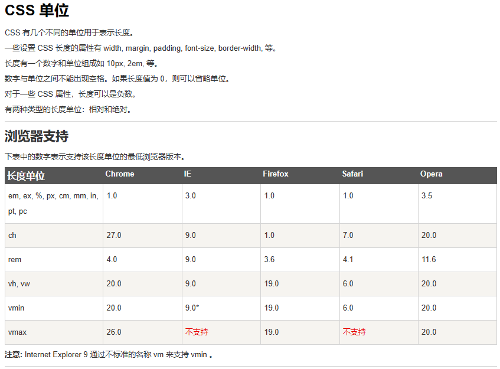
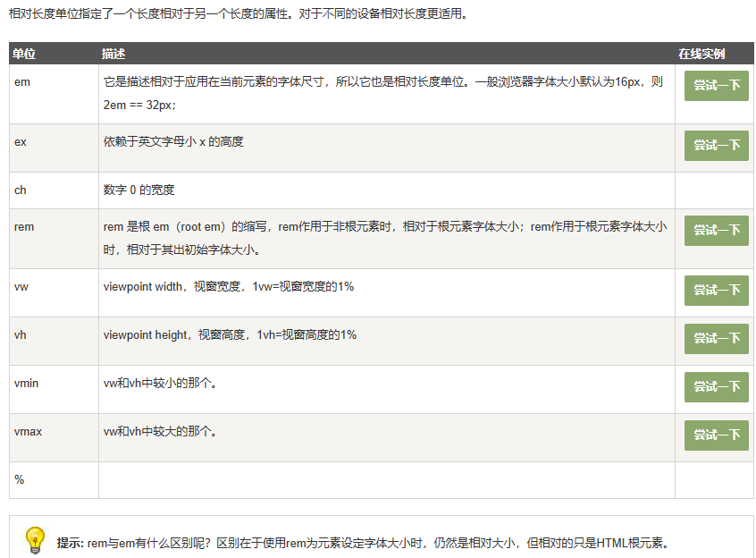
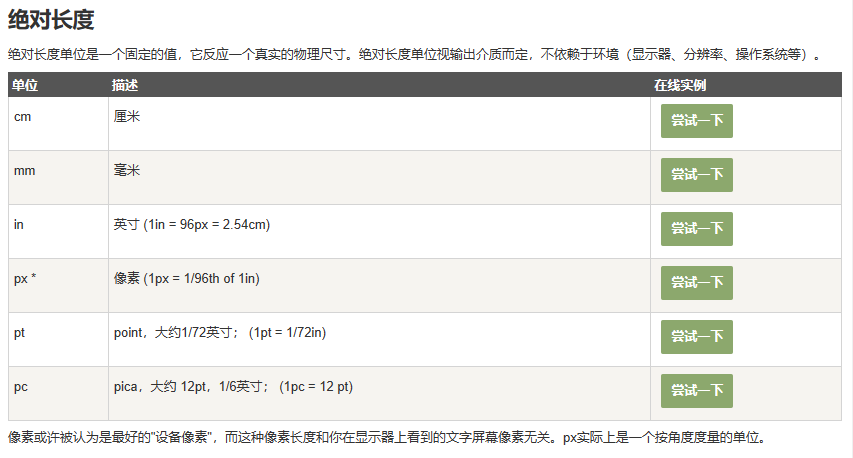

# CSS单位

# CSS相对长度

# 绝对长度

# 分辨率
屏幕分辨率
屏幕分辨率是屏幕显示的像素总数，再细分一下就有：物理分辨率和显示器分辨率。

物理分辨率是显示器的固有参数，不能调节，一般是指屏幕的最高可显示的像素数。
显示器分辨率就是操作系统设定的分辨率。在显示器分辨率和物理分辨率一致时，显示效果才是最佳的，一般推荐设置的分辨率就是物理分辨率。系统设置分辨率生效是通过算法进行了转换。

举个例子，在手机上的看关于手机信息，可以看到分辨率信息为 720*1280 ，意思就是屏幕水平方向上有 720 个像素，垂直方向上有 1280 个像素。

