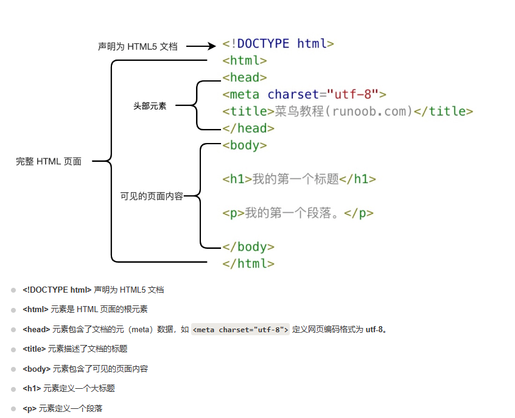
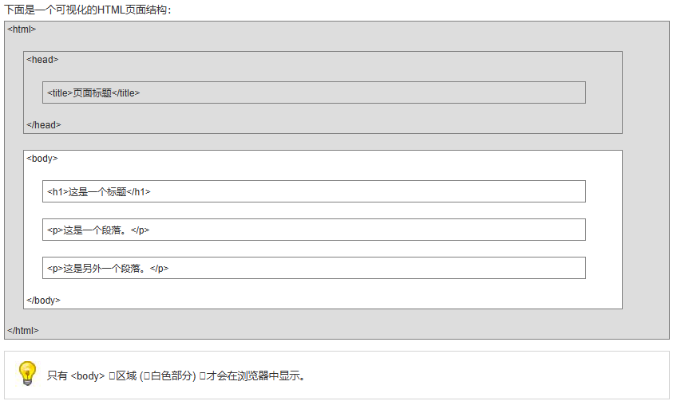
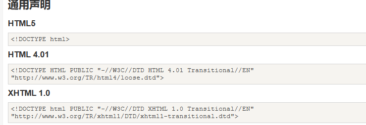

# 代码示例

```html
<!DOCTYPE html>
<html>
<head>
    <meta charset="utf-8">
    <title>菜鸟教程</title>
</head>

<body>
    <h1>我第一个标题</h1> 
</body>
</html>
```

## 示例说明



# 网页结构说明





# HTML的不同版本

* 版本	发布时间
* HTML	1991
* HTML+	1993
* HTML 2.0	1995
* HTML 3.2	1997
* HTML 4.01	1999
* XHTML 1.0	2000
* HTML5	2012
* XHTML5	2013


## 版本声明

    <!DOCTYPE html> 不取分大小写

### 通用声明





