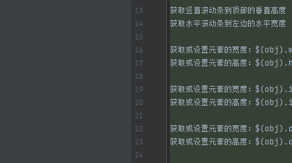

#JavaScript常用命令
##常用的一些函数
```text
获取浏览器显示区域（可视区域）的高度 ： $(window).height();
获取浏览器显示区域（可视区域）的宽度 ： $(window).width();

获取页面的文档高度：$(document).height();
获取页面的文档宽度 ：$(document).width();

浏览器当前窗口文档body的高度： $(document.body).height();
浏览器当前窗口文档body的宽度： $(document.body).width();

获取竖直滚动条到顶部的垂直高度 (即网页被卷上去的高度) ：$(document).scrollTop();
获取水平滚动条到左边的水平宽度 (即网页被卷左去的宽度)：$(document).scrollLeft();

获取或设置元素的宽度：$(obj).width();(width) 注意只是元素的宽度，不包括padding
获取或设置元素的高度：$(obj).height();(height) 注意只是元素的高度，不包括padding

获取或设置元素的宽度：$(obj).innerWidth(); (width + padding)
获取或设置元素的高度：$(obj).innerHeight(); (height + padding)

获取或设置元素的宽度：$(obj).outerWidth(); (width + padding + border)
获取或设置元素的高度：$(obj).outerHeight(); (height + padding + border)

获取元素的宽度：$(obj).outerWidth(true); (width + padding + border + margin)
获取元素的高度：$(obj).outerHeight(true); (height + padding + border + margin)

某个元素的上边界距文档最上边距离：obj.offset().top;
某个元素的左边界距文档最左边距离：obj.offset().left;
```





```plantuml
@startuml
a-> b
@enduml


```
